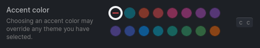

<p align="center">
  
</p>
<h1 align="center">
  <br>Logseq One Theme<br>
</h1>

<p align="center">
  <a href="#screenshots">📸 Screenshots</a>
   | 
  <a href="#whats-changed">✨ What's changed</a>
   | 
  <a href="#install">📦 Install</a>
   | 
  <a href="#how-to-build">🔨 How to build</a>
   | 
  <a href="#credits">🙏 Credits</a>
</p>

<p align="center">A clean theme for <a href="https://github.com/logseq/logseq">Logseq</a> inspired by One Dark Pro.<br>Tested with Logseq v0.10.7!</p>

## Accent colors not fully supported (yet)

For the best experience, please disable the accent color!
<small>Most accent colors actually work. Tests have shown that the first accent color option (named "Logseq classical color") breaks the layout and colors!</small>



> Use the Logseq version named above in combination with the latest theme release to ensure best appearance!

## Screenshots


| Dark | Light |
| --------------- | ---------------- |
|  |  |

## What's changed

### Features

- included page property icons
- improved block reference style
- header labels
- included task and admonition block styles (as can be found in plugin logseq-awesome-content)
- integrated support for banners plugin
- support for new accent color selection (introduced in Logseq v0.10.0)
- numerous improvements & fixes to color scheme and polished header styles (compared to original Atmos theme)
- support for mobile devices (see below for instructions) (WIP)

### Inspired by: Atmos Theme

The Logseq One Theme in its first iteration is strongly inspired by [logseq-atmos-theme](https://github.com/Mat4m0/logseq-atmos-theme). Its stylesheet has been largely rewritten and this new theme aims to provide a cleaner experience and set some different accents.

<details>
  <summary>Basic differences</summary>

> This list might be outdated and there may be more differences now as this project is evolving. Probably there are more to come as the theme will go in another direction.

- scrollbar: less obtrusive
- headings
  - reduced weight of font
  - slightly less underlining thickness
  - restored normal case
- dark theme: accentuated bold and italic font color
- page & block properties: restyled with borders
- selection: better background color for selected blocks
- tasks: dim done or canceled elements (instead of strike through)
- journal: changed header icon
- links: adjusted hover style for external links
- Fix: invisible PDF annotation pages title
- Fix: missing hover style for PDF asset links
- Fix: inconsistent menu and header button styling and hover animations
- Fix: readability of light codemirror theme
- Fix: unwanted gradient background in left sidebar bottom area
- Fix: banners integration in wide mode
- Fix: unused variables, invalid CSS selectors / rules from Atmos
- Refactor: use standard Logseq variables to prevent redundant CSS rules
</details>

### Known issues / Roadmap

- [x] table styles
- [x] page tooltip layout
- [ ] complete accent color support (WIP)
- [ ] dark theme: mixture of bold and italic styles (consistency)
- [ ] light code mirror theme inconsistency
- [ ] improve mobile support

## Install

### Official marketplace (within Logseq, recommended)

Find the One Theme in the Logseq in-app theme marketplace:
- Search for 'One Theme' in `«...»` → `Plugins` → `Marketplace` → `Themes`
- To select theme: `«...»` → `Themes` (or press `t` `i`) → select desired variant 'One Theme'
  - press `t` `t` to toggle between light and dark themes

### Manual installation (and for mobile devices)

1. Open `«...»` → `Settings`
2. Select `Edit custom.css`
3. Insert the following code to the top of your `custom.css`:
  ```css
  @import url("https://raw.githubusercontent.com/femto-code/logseq-one-theme/main/main.css");
  ```
  (with borders) or
  ```css
  @import url("https://raw.githubusercontent.com/femto-code/logseq-one-theme/main/main2.css");
  ```
  for version without borders (v2)

#### Fully manual way (if other ways don't work)

Copy `main.css` [contents](https://raw.githubusercontent.com/femto-code/logseq-one-theme/master/main.css) (with borders) or `main2.css` [contents](https://raw.githubusercontent.com/femto-code/logseq-one-theme/master/main2.css) (without borders, v2) into `<graph_base>/logseq/custom.css`

> Keep in mind, that each update needs to applied manually when using this approach!

## How to build

> Install [node](https://nodejs.org/)
1. Clone repo
  ```shell
  git clone https://github.com/femto-code/logseq-one-theme.git && cd logseq-one-theme
  ```
2. Install (development) dependencies (sass)
  ```shell
  npm install
  ```
3. Run build
  ```shell
  npm run build
  ```
  > Tip: append `:v2` for borderless theme variant

## Credits

This is a theme for [Logseq](https://github.com/logseq/logseq) - a privacy-first, open-source platform for knowledge management and collaboration under [AGPL-3.0 license](https://github.com/logseq/logseq/blob/master/LICENSE.md).

Thanks to the following creators for inspiration and reference:

- [logseq-atmos-theme](https://github.com/Mat4m0/logseq-atmos-theme): `Copyright (c) 2022 Matthias A.` ([MIT License](https://github.com/Mat4m0/logseq-atmos-theme/blob/main/LICENSE))
  - (especially) banners integration, color palette, headers and dark code mirror theme
- [logseq-bujo-theme](https://github.com/stdword/logseq-bujo-theme): `Copyright (c) 2022 Sergey Kolesnik (@stdword)` ([MIT License](https://github.com/stdword/logseq-bujo-theme/blob/main/LICENSE))
  - block-ref style and page-property icons
- [logseq-awesome-content](https://github.com/yoyurec/logseq-awesome-content): `Copyright (c) 2022 Yuriy Piskun` ([MIT License](https://github.com/yoyurec/logseq-awesome-content/blob/main/LICENSE))
  - task and admonition block styles
- [logseq-ozean-theme](https://github.com/hisea/logseq-ozean-theme): `Copyright (c) 2022 Yinghai Zhao` ([MIT License](https://github.com/hisea/logseq-ozean-theme/blob/main/LICENSE))
  - light codemirror theme
- [logseq-mocha-theme](https://github.com/blueteafrog/logseq-mocha-theme): `Copyright (c) 2021 BlueTeaFrog` ([MIT License](https://github.com/blueteafrog/logseq-mocha-theme/blob/main/LICENSE))
  - page/block property container style and external link decoration

## Issues & Feedback
Feel free to submit an [issue](https://github.com/femto-code/logseq-one-theme/issues). Contributions and suggestions to improve the theme are welcome!

---
<div align="center">
Copyright © 2024 <a href="https://github.com/femto-code">femto-code</a>

[MIT License](./LICENSE)
</div>
